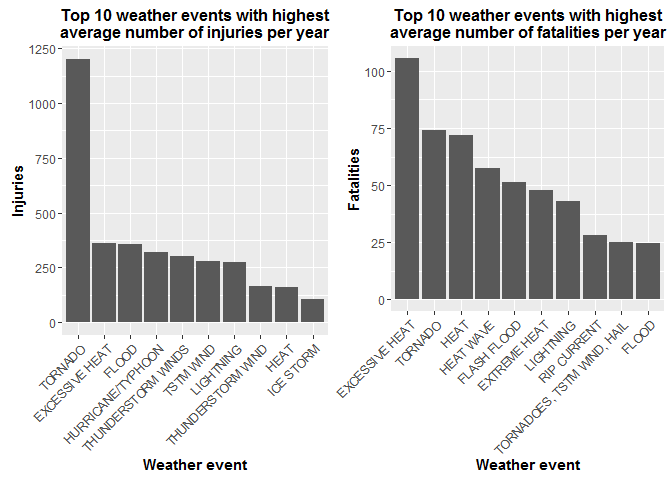
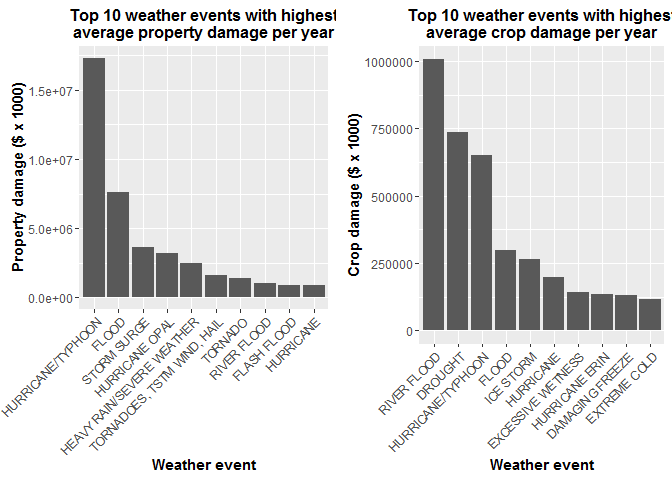

# An investigation on public health and economic effects of extreme weather conditions in the USA
Rona1d  
may 9, 2016  

### Synopsis


*This report was written in fullfillment of the first assignment of week 4 of the 'Reproducible Research' course within the Coursera specialization track 'Data Science'. The analysis shows that tornado's and excessive heat have the most effect on public health with on average 1200 injuries and 105 fatalities per year respectively. Hurricanes/typhoons and river flood have the greatest economic consquences with respectively $17.3 billion property damage and $1.0 billion crop damage on average each year.*

### Introduction

Storms and other severe weather events can cause both public health and economic problems for communities and municipalities. Many severe events can result in fatalities, injuries, and damage to properties and crops, and preventing such outcomes to the extent possible is a key concern.

This project involves exploring the U.S. National Oceanic and Atmospheric Administration's (NOAA) storm database. This database tracks characteristics of major storms and weather events in the United States, including when and where they occur, as well as estimates of any fatalities, injuries, property and crop damage.

### Data processing

The data analysed in this report originates from the National Oceanic and Atmospheric Administration (NOAA).
For detailed information about the dataset, please access the following documentation. With this, you will find how some of the variables are constructed/defined:

* National Weather Service [Storm Data Documentation](https://d396qusza40orc.cloudfront.net/repdata%2Fpeer2_doc%2Fpd01016005curr.pdf)
* National Climatic Data Center [Storm Events FAQ](https://d396qusza40orc.cloudfront.net/repdata%2Fpeer2_doc%2FNCDC%20Storm%20Events-FAQ%20Page.pdf)


#### Downloading the dataset

To start of the research we first need to download the available data. This dataset was made available through the Coursera website.


```r
# First, make sure a folder named 'data' exists

if(!file.exists("data")) {
        dir.create("data")
}
setwd("./data")

# Downloading file...

temp <- tempfile()
fileURL <- "https://d396qusza40orc.cloudfront.net/repdata%2Fdata%2FStormData.csv.bz2"
setInternet2(use = TRUE)
download.file(fileURL, "./StormData.csv.bz2")
data <- read.csv("StormData.csv.bz2")
```

This dataset contains 902297 rows and 37 columns. This is what the first few rows of the dataset look like:


```r
head(data)
```

```
##   STATE__           BGN_DATE BGN_TIME TIME_ZONE COUNTY COUNTYNAME STATE
## 1       1  4/18/1950 0:00:00     0130       CST     97     MOBILE    AL
## 2       1  4/18/1950 0:00:00     0145       CST      3    BALDWIN    AL
## 3       1  2/20/1951 0:00:00     1600       CST     57    FAYETTE    AL
## 4       1   6/8/1951 0:00:00     0900       CST     89    MADISON    AL
## 5       1 11/15/1951 0:00:00     1500       CST     43    CULLMAN    AL
## 6       1 11/15/1951 0:00:00     2000       CST     77 LAUDERDALE    AL
##    EVTYPE BGN_RANGE BGN_AZI BGN_LOCATI END_DATE END_TIME COUNTY_END
## 1 TORNADO         0                                               0
## 2 TORNADO         0                                               0
## 3 TORNADO         0                                               0
## 4 TORNADO         0                                               0
## 5 TORNADO         0                                               0
## 6 TORNADO         0                                               0
##   COUNTYENDN END_RANGE END_AZI END_LOCATI LENGTH WIDTH F MAG FATALITIES
## 1         NA         0                      14.0   100 3   0          0
## 2         NA         0                       2.0   150 2   0          0
## 3         NA         0                       0.1   123 2   0          0
## 4         NA         0                       0.0   100 2   0          0
## 5         NA         0                       0.0   150 2   0          0
## 6         NA         0                       1.5   177 2   0          0
##   INJURIES PROPDMG PROPDMGEXP CROPDMG CROPDMGEXP WFO STATEOFFIC ZONENAMES
## 1       15    25.0          K       0                                    
## 2        0     2.5          K       0                                    
## 3        2    25.0          K       0                                    
## 4        2     2.5          K       0                                    
## 5        2     2.5          K       0                                    
## 6        6     2.5          K       0                                    
##   LATITUDE LONGITUDE LATITUDE_E LONGITUDE_ REMARKS REFNUM
## 1     3040      8812       3051       8806              1
## 2     3042      8755          0          0              2
## 3     3340      8742          0          0              3
## 4     3458      8626          0          0              4
## 5     3412      8642          0          0              5
## 6     3450      8748          0          0              6
```

#### Data transformations

For this investigation, not all of the variables in the dataset will be needed. The first data transformation will only keep the variables date, event type, fatalities, injuries, property and crop damage (plus their corresponding 'exp' variables). Note that we need to calculate the year in which the event happened from the date of the event ('BGN_DATE') to be able to calculate average occurrences per year.


```r
data2 <- data[,c(2, 8, 23, 24, 25, 26, 27, 28)]
rm(data)  # remove 'data' from Global Environment

# Calculate the year in which the event occurred

year1 <- as.POSIXct(strptime(as.character(data2$BGN_DATE),"%m/%d/%Y %H:%M:%S"))
data2$year <- as.numeric(format(year1,'%Y'))
rm(year1)

summary(data2)
```

```
##               BGN_DATE                    EVTYPE         FATALITIES      
##  5/25/2011 0:00:00:  1202   HAIL             :288661   Min.   :  0.0000  
##  4/27/2011 0:00:00:  1193   TSTM WIND        :219940   1st Qu.:  0.0000  
##  6/9/2011 0:00:00 :  1030   THUNDERSTORM WIND: 82563   Median :  0.0000  
##  5/30/2004 0:00:00:  1016   TORNADO          : 60652   Mean   :  0.0168  
##  4/4/2011 0:00:00 :  1009   FLASH FLOOD      : 54277   3rd Qu.:  0.0000  
##  4/2/2006 0:00:00 :   981   FLOOD            : 25326   Max.   :583.0000  
##  (Other)          :895866   (Other)          :170878                     
##     INJURIES            PROPDMG          PROPDMGEXP        CROPDMG       
##  Min.   :   0.0000   Min.   :   0.00          :465934   Min.   :  0.000  
##  1st Qu.:   0.0000   1st Qu.:   0.00   K      :424665   1st Qu.:  0.000  
##  Median :   0.0000   Median :   0.00   M      : 11330   Median :  0.000  
##  Mean   :   0.1557   Mean   :  12.06   0      :   216   Mean   :  1.527  
##  3rd Qu.:   0.0000   3rd Qu.:   0.50   B      :    40   3rd Qu.:  0.000  
##  Max.   :1700.0000   Max.   :5000.00   5      :    28   Max.   :990.000  
##                                        (Other):    84                    
##    CROPDMGEXP          year     
##         :618413   Min.   :1950  
##  K      :281832   1st Qu.:1995  
##  M      :  1994   Median :2002  
##  k      :    21   Mean   :1999  
##  0      :    19   3rd Qu.:2007  
##  B      :     9   Max.   :2011  
##  (Other):     9
```

Quick exploration of the dataset shows that in the early years, a relatively low amount of events was recorded. Probably the method of recording extreme weather events improved over the years. 


```r
table1 <- as.data.frame(table(data2$year))
names(table1) <- c("year", "frequency")
table1
```

```
##    year frequency
## 1  1950       223
## 2  1951       269
## 3  1952       272
## 4  1953       492
## 5  1954       609
## 6  1955      1413
## 7  1956      1703
## 8  1957      2184
## 9  1958      2213
## 10 1959      1813
## 11 1960      1945
## 12 1961      2246
## 13 1962      2389
## 14 1963      1968
## 15 1964      2348
## 16 1965      2855
## 17 1966      2388
## 18 1967      2688
## 19 1968      3312
## 20 1969      2926
## 21 1970      3215
## 22 1971      3471
## 23 1972      2168
## 24 1973      4463
## 25 1974      5386
## 26 1975      4975
## 27 1976      3768
## 28 1977      3728
## 29 1978      3657
## 30 1979      4279
## 31 1980      6146
## 32 1981      4517
## 33 1982      7132
## 34 1983      8322
## 35 1984      7335
## 36 1985      7979
## 37 1986      8726
## 38 1987      7367
## 39 1988      7257
## 40 1989     10410
## 41 1990     10946
## 42 1991     12522
## 43 1992     13534
## 44 1993     12607
## 45 1994     20631
## 46 1995     27970
## 47 1996     32270
## 48 1997     28680
## 49 1998     38128
## 50 1999     31289
## 51 2000     34471
## 52 2001     34962
## 53 2002     36293
## 54 2003     39752
## 55 2004     39363
## 56 2005     39184
## 57 2006     44034
## 58 2007     43289
## 59 2008     55663
## 60 2009     45817
## 61 2010     48161
## 62 2011     62174
```
*Table 1: Amount of recorded events per year*

As we can see in table 1, there is a sharp increase in observations the last 20 to 30 years. The low amount of data per year in the early years could influence calculations on the average annual impact of the events. Furthermore, one could argue that measures taken to prevent harm from extreme weather conditions will have improved over the years (e.g. better early warning systems for tornado's and floodings or better airconditioned houses), meaning that recent data will paint a more accurate picture than non recent data.

It is therefore decided to use the subset of data which starts at the year 1982. With this, we will still be having about 90% of the original observations left, but without about half the number of years. The dataset used for further analysis will be 'data3'


```r
data3 <- data2[data2$year > "1981",]
data3 <- data3[,c(2:9)] # Remove the original variable 'BGN_DATE'
rm(data2)               # Remove 'data2' from Global Environment
summary(data3)
```

```
##                EVTYPE         FATALITIES          INJURIES        
##  HAIL             :264031   Min.   :  0.0000   Min.   :   0.0000  
##  TSTM WIND        :182222   1st Qu.:  0.0000   1st Qu.:   0.0000  
##  THUNDERSTORM WIND: 82563   Median :  0.0000   Median :   0.0000  
##  FLASH FLOOD      : 54277   Mean   :  0.0144   Mean   :   0.1044  
##  TORNADO          : 36971   3rd Qu.:  0.0000   3rd Qu.:   0.0000  
##  FLOOD            : 25326   Max.   :583.0000   Max.   :1568.0000  
##  (Other)          :170878                                         
##     PROPDMG          PROPDMGEXP        CROPDMG          CROPDMGEXP    
##  Min.   :   0.00          :403586   Min.   :  0.000          :532384  
##  1st Qu.:   0.00   K      :402420   1st Qu.:  0.000   K      :281832  
##  Median :   0.00   M      :  9894   Median :  0.000   M      :  1994  
##  Mean   :  11.88   0      :   216   Mean   :  1.688   k      :    21  
##  3rd Qu.:   1.00   B      :    40   3rd Qu.:  0.000   0      :    19  
##  Max.   :5000.00   5      :    28   Max.   :990.000   B      :     9  
##                    (Other):    84                     (Other):     9  
##       year     
##  Min.   :1982  
##  1st Qu.:1997  
##  Median :2003  
##  Mean   :2002  
##  3rd Qu.:2008  
##  Max.   :2011  
## 
```

The last thing we want to look at is in what amounts the property damage and crop damage are specified
The registered damage on property and crops (PROPDMG and CROPDMG) have additional variables that indicate their monetary magnitude. The documentation states that PROPDMGEXP and CROPDMGEXP should provide a "alphabetical character signifying the magnitude of the number (of damage)". So let's look at what these variables look like:


```r
table(data3$PROPDMGEXP)
```

```
## 
##             -      ?      +      0      1      2      3      4      5 
## 403586      1      8      5    216     25     13      4      4     28 
##      6      7      8      B      h      H      K      m      M 
##      4      5      1     40      1      6 402420      7   9894
```

```r
table(data3$CROPDMGEXP)
```

```
## 
##             ?      0      2      B      k      K      m      M 
## 532384      7     19      1      9     21 281832      1   1994
```

The alphabetical characters that should have been used, should be (according to documentation) "K" for thousands, "M" for millions, and "B" for billions. However, in the tables provided, we see that different characters, different cases and even numbers are being used. But given the fact that 'K', 'M' and 'B' are frequently used and are easy to interpret, we will be recoding the amount of property and crop damage according to these exponents. Unrecognised exponents will be recoded to '1'.


```r
# Initiate new variables with value 1

data3$prop_exp <- 1
data3$crop_exp <- 1

# Recode these variables based on their corresponding 'EXP' variables:

data3$prop_exp[data3$PROPDMGEXP %in% c("K", "k")] <- 1000
data3$prop_exp[data3$PROPDMGEXP %in% c("M", "m")] <- 1000000
data3$prop_exp[data3$PROPDMGEXP %in% c("B", "b")] <- 1000000000

data3$crop_exp[data3$CROPDMGEXP %in% c("K", "k")] <- 1000
data3$crop_exp[data3$CROPDMGEXP %in% c("M", "m")] <- 1000000
data3$crop_exp[data3$CROPDMGEXP %in% c("B", "b")] <- 1000000000

# Recode the original 'Damage' variables

data3$PROPDMG <- (data3$PROPDMG*data3$prop_exp)/1000
data3$CROPDMG <- (data3$CROPDMG*data3$crop_exp)/1000
data3 <- data3[,c(1,2,3,4,6,8)]

summary(data3)
```

```
##                EVTYPE         FATALITIES          INJURIES        
##  HAIL             :264031   Min.   :  0.0000   Min.   :   0.0000  
##  TSTM WIND        :182222   1st Qu.:  0.0000   1st Qu.:   0.0000  
##  THUNDERSTORM WIND: 82563   Median :  0.0000   Median :   0.0000  
##  FLASH FLOOD      : 54277   Mean   :  0.0144   Mean   :   0.1044  
##  TORNADO          : 36971   3rd Qu.:  0.0000   3rd Qu.:   0.0000  
##  FLOOD            : 25326   Max.   :583.0000   Max.   :1568.0000  
##  (Other)          :170878                                         
##     PROPDMG            CROPDMG           year     
##  Min.   :0.00e+00   Min.   :0e+00   Min.   :1982  
##  1st Qu.:0.00e+00   1st Qu.:0e+00   1st Qu.:1997  
##  Median :0.00e+00   Median :0e+00   Median :2003  
##  Mean   :5.04e+02   Mean   :6e+01   Mean   :2002  
##  3rd Qu.:1.00e+00   3rd Qu.:0e+00   3rd Qu.:2008  
##  Max.   :1.15e+08   Max.   :5e+06   Max.   :2011  
## 
```

The dataset doesn't seem to contain any NA's and is ready for analysis

### Results

The 2 main questions we want to answer here are:

1. Across the United States, which types of events (as indicated in the EVTYPE variable) are most harmful with respect to population health?
2. Across the United States, which types of events have the greatest economic consequences?

#### Population health

To answer the question on population health, we can look at 2 variables in the dataset: FATALITIES and INJURIES.

First look at some totals:


```r
# Looking at total injuries: 

injury1 <- tapply(data3$INJURIES, data3$EVTYPE, sum)
sort1 <- sort(injury1, decreasing = TRUE)
head(sort1, n=5)
```

```
##        TORNADO      TSTM WIND          FLOOD EXCESSIVE HEAT      LIGHTNING 
##          36016           6957           6789           6525           5230
```

```r
# Looking at total fatalities:

fatal1 <- tapply(data3$FATALITIES, data3$EVTYPE, sum)
sort2 <- sort(fatal1, decreasing = TRUE)
head(sort2, n=5)
```

```
##        TORNADO EXCESSIVE HEAT    FLASH FLOOD           HEAT      LIGHTNING 
##           2222           1903            978            937            816
```

From the totals we can see that tornado's have caused by far the most injuries. Looking at fatalities, tornado's by it self also cause the most fatalities. However, since 'EXCESSIVE HEAT' and 'HEAT' are also in the top 5 fatalities it seems that the event category 'heat' could cause the most fatalities. The totals however could be strongly influenced by spikes in the data. 

To identify which event is the most harmful for population health, we want to know which event on average causes the most injuries and fatalities per year.


```r
library(plyr)
library(ggplot2)
library(gridExtra)

# Injuries

injury_yr <- ddply(data3,.(EVTYPE,year), summarise, total=sum(INJURIES))
injury_avgyr <- ddply(injury_yr,.(EVTYPE), summarise, Avg_injuries=mean(total))
sort_inj <- injury_avgyr[order(-injury_avgyr$Avg_injuries),]
sort_inj10 <- sort_inj[c(1:10),]

# Fatalities

fatal_yr <- ddply(data3,.(EVTYPE,year), summarise, total=sum(FATALITIES))
fatal_avgyr <- ddply(fatal_yr,.(EVTYPE), summarise, Avg_fatalities=mean(total))
sort_fat <- fatal_avgyr[order(-fatal_avgyr$Avg_fatalities),]
sort_fat10 <- sort_fat[c(1:10),]
```

```r
require(gridExtra)
plot1 <- ggplot(sort_inj10, aes(x = reorder(EVTYPE, -Avg_injuries), y = Avg_injuries)) + 
        geom_bar(stat="identity") +
        ggtitle("Top 10 weather events with highest\naverage number of injuries per year") +
        theme(plot.title = element_text(face="bold", size = 12)) +
        theme(axis.text.x = element_text(angle = 45, vjust = 1, hjust=1), 
              axis.title.x = element_text(face="bold"),
              axis.title.y = element_text(face="bold")) +
        ylab("Injuries") +
        xlab("Weather event")

plot2 <- ggplot(sort_fat10, aes(x = reorder(EVTYPE, -Avg_fatalities), y = Avg_fatalities)) + 
        geom_bar(stat="identity") +
        ggtitle("Top 10 weather events with highest\naverage number of fatalities per year") +
        theme(plot.title = element_text(face="bold", size = 12)) +
        theme(axis.text.x = element_text(angle = 45, vjust = 1, hjust=1), 
              axis.title.x = element_text(face="bold"),
              axis.title.y = element_text(face="bold")) +
        ylab("Fatalities") +
        xlab("Weather event")

grid.arrange(plot1, plot2, ncol=2)
```

<!-- -->

*Figure 1: Top 10 weather events which cause on average the most injuries and fatalities per year*

Figure 1 shows the weather events with most impact on population health. 
In terms of injuries, tornado's have the highest impact with, on average, just over 1200 injuries per year across the United States. The top 10 injuries consists of even 5 more wind related weather events (hurricane/typhoon, thunderstorm winds (3 different labels) and ice storm). This makes high winds in general a strong cause of injuries across the United States.
In terms of fatalities, excessive heat has the highest impact, with on average about 105 fatalities per year across the United States. Notably, the top 10 fatalities consists of even 3 more heat related weather events (heat, heat wave and extreme heat), making heat in general a major cause of fatalities across the Unites States each year.


#### Economic consequences

To answer the question on economic consequences, we can look at 2 variables in the dataset: PROPDMG and CROPDMG.

First look at some totals:


```r
# Looking at total property damage (in $US x 1000): 

prop1 <- tapply(data3$PROPDMG, data3$EVTYPE, sum)
sort3 <- sort(prop1, decreasing = TRUE)
head(sort3, n=5)
```

```
##             FLOOD HURRICANE/TYPHOON       STORM SURGE           TORNADO 
##         144657710          69305840          43323536          40719874 
##       FLASH FLOOD 
##          16140812
```

```r
# Looking at total crop damage (in $US x 1000):

crop1 <- tapply(data3$CROPDMG, data3$EVTYPE, sum)
sort4 <- sort(crop1, decreasing = TRUE)
head(sort4, n=5)
```

```
##     DROUGHT       FLOOD RIVER FLOOD   ICE STORM        HAIL 
##    13972566     5661968     5029459     5022114     3025954
```

From the totals we can see that flood has caused the most damage to properties. The top 5 weather events in terms of property damage are in general either wind or flood related. Looking at crop damage, drought is the most harmful weather event, followed by floodings , ice storm and hail.

To identify which weather event has the biggest economic consequences, we want to know which event on average causes the most damage to properties and crops per year.


```r
# Property damage

propdmg_yr <- ddply(data3,.(EVTYPE,year), summarise, total=sum(PROPDMG))
propdmg_avgyr <- ddply(propdmg_yr,.(EVTYPE), summarise, Avg_prop_dmg=mean(total))
sort_prop <- propdmg_avgyr[order(-propdmg_avgyr$Avg_prop_dmg),]
sort_prop10 <- sort_prop[c(1:10),]

# Crop damage

cropdmg_yr <- ddply(data3,.(EVTYPE,year), summarise, total=sum(CROPDMG))
cropdmg_avgyr <- ddply(cropdmg_yr,.(EVTYPE), summarise, Avg_crop_dmg=mean(total))
sort_crop <- cropdmg_avgyr[order(-cropdmg_avgyr$Avg_crop_dmg),]
sort_crop10 <- sort_crop[c(1:10),]
```

```r
require(gridExtra)
plot3 <- ggplot(sort_prop10, aes(x = reorder(EVTYPE, -Avg_prop_dmg), y = Avg_prop_dmg)) + 
        geom_bar(stat="identity") +
        ggtitle("Top 10 weather events with highest\naverage property damage per year") +
        theme(plot.title = element_text(face="bold", size = 12)) +
        theme(axis.text.x = element_text(angle = 45, vjust = 1, hjust=1), 
              axis.title.x = element_text(face="bold"),
              axis.title.y = element_text(face="bold")) +
        ylab("Property damage ($ x 1000)") +
        xlab("Weather event")

plot4 <- ggplot(sort_crop10, aes(x = reorder(EVTYPE, -Avg_crop_dmg), y = Avg_crop_dmg)) + 
        geom_bar(stat="identity") +
        ggtitle("Top 10 weather events with highest\naverage crop damage per year") +
        theme(plot.title = element_text(face="bold", size = 12)) +
        theme(axis.text.x = element_text(angle = 45, vjust = 1, hjust=1), 
              axis.title.x = element_text(face="bold"),
              axis.title.y = element_text(face="bold")) +
        ylab("Crop damage ($ x 1000)") +
        xlab("Weather event")

grid.arrange(plot3, plot4, ncol=2)
```

<!-- -->

*Figure 2: Top 10 weather events which cause on average the most damage to properties and crops per year*

Figure 2 displays the weather events which cause the most economic damage. 
In terms of damage to property, hurricane/typhoon has the highest impact with, on average, $17.3 billion per year across the United States. The top 10 injuries consists of even 5 more wind related weather events. This makes high winds in general a strong cause of property damage across the Unites States.
In terms of damage to crops, river flood is, with $1.0 billion on average per year, the single weather event with the highest damage to crops. This is followed by different types of extreme weather, ranging from drought to excessive wetness. 

### Discussion

In this report, we were able to identify which weather events have the strongest impact on population health and which have the biggest economic consequences. However, in identifying the weather types, it was noted that a lot of the labeled weather events have similar characteristics or could even be labeled as identical (e.g. 'Thunderstorm Winds' and 'Thunderstorm Wind'). In further research this labeling issue should definitely be adressed for better identification of which weather event has which impact. Finally, to be able to effectively execute policy to reduce the negative impact of extreme weather events, one should look at the specific weather events within each seperate state. 
